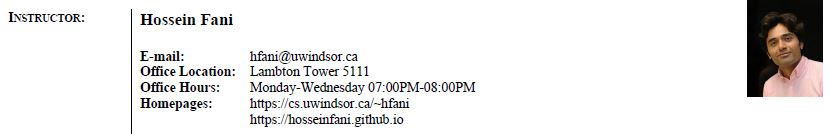
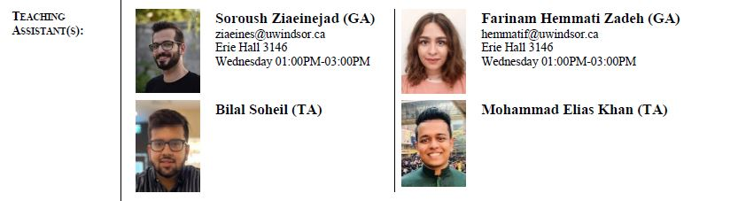

# 2022: A Data Odyssey! 
Materials for the Computer Science course Database Management Systems.

       

This course will acquaint students with the basic concepts of Database Systems. The topics covered will include 3-layered software architecture, `data modeling` at `conceptual`, `logical`, and `physical` levels, the benefits of dbms vs. files and `ACID` properties.  Further, the course covers data modeling for `relational` dbms, relational model, relational algebra, `SQL`, and `normalization` theory.

    
      
      
      
    
          

## License
©2021. All materials available here are licensed under a [CC BY-NC-SA 4.0](LICENSE.txt) license. 
